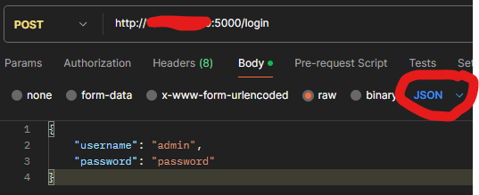

# Firts Python API with JWT

LOREM IPSUM DOLOR SIT AMET,

# Get token

1 - In the request's body we need to put:

```json
{
    "username": "admin",
    "password": "password"
}
```

In Postman select **Body** -> **raw** -> so, target option **JSON** and paste the json.



# Get Data


# Libraries

```bash
pip install flask pyjwt mysql-connector-python
```

```bash
pip install flask pyjwt mysql-connector-python
```

Allow port :5000 in the firewalls

* Look if we have **ufw**

```bash
apt-cache pkgnames | grep ufw
```

* Install ufw if we didn't have it

```bash
sudo apt install ufw -y
sudo ufw allow 5000
```